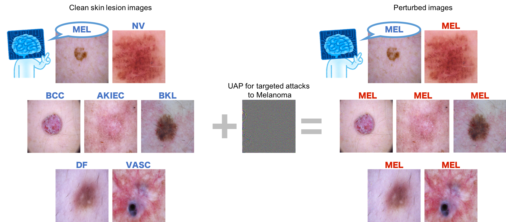

# MedicalAI-UAP

This repository contains the codes used in our study on *[Universal adversarial attacks on deep neural networks for medical image classification](https://doi.org/10.1186/s12880-020-00530-y)*.

## Terms of use

MIT licensed. Happy if you cite our paper when using the codes:

 H, Minagi K & Takemoto K (2021) **Universal adversarial attacks on deep neural networks for medical image classification.** BMC Med. Imaging 21, 9. doi:[10.1186/s12880-020-00530-y](https://doi.org/10.1186/s12880-020-00530-y)

## Usage

```
# Directories
.
├── MedicalAI-UAP
└── dataset
    ├── CellData
    └── ISIC2018_Task3_Training_Input
```

### 1. Check the requirements.

- Python 3.6.6
- tensorflow-gpu 1.12.0
- Keras 2.2.4
- Keras-Applications 1.0.8
- numpy 1.18.2
- pandas 1.0.5
- scikit-learn 0.22.2.post1
- imbalanced-learn 0.6.2
- matplotlib 2.0.2
- Pillow 4.2.1
- tqdm 4.43.0

### 2. Download the following datasets.

- Skin lesion images
    - [ISIC2018 Task 3: Lesion Diagnosis: Training](https://challenge2018.isic-archive.com/task3/training/)
- OCT and Chest X-ray images
    - [Identifying Medical Diagnoses and Treatable Diseases by Image-Based Deep Learning](https://www.sciencedirect.com/science/article/pii/S0092867418301545?via%3Dihub)

### 3. Generate the dataset.

```sh
# malanoma
python make_data.py --dataset melanoma --img_dir ../dataset/ISIC2018_Task3_Training_Input

# oct
python make_data.py --dataset oct --img_dir ../dataset/CellData/OCT

# chestx
python make_data.py --dataset chestx --img_dir ../dataset/CellData/chest_xray
```

### 4. Train

```sh
python train_model.py --dataset melanoma --model inceptionv3

# `--dataset` argument indicates the dataset: melanoma, oct or chestx (default).
# `--model` argument indicates the model: inceptionv3 (default), vgg16, vgg19, resnet50, inceptionresnetv2, densenet121 or densenet169.
```

### 5. Install the methods for generating universal adversarial perturbations (UAPs).

- `pip install git+https://github.com/hkthirano/adversarial-robustness-toolbox`

### 6. Generate UAPs.

```sh
# non-targeted UAP
python generate_nontargeted_uap.py --dataset melanoma

# UAP for targeted attacks to MEL
python generate_targeted_uap.py --dataset melanoma --target MEL
# `--target` argument indicates the target class:
#   when dataset is melanoma, the target class: MEL, NV, BCC, AKIEC, BKL, DF or VASC.
#   when dataset is oct     , the target class: CNV, DME, DRUSEN or NORMAL.
#   when dataset is chestx  , the target class: NORMAL or PNEUMONIA (default).

# random UAP
python generate_random_uap.py --dataset melanoma
```

### 7. Results

The targeted UAP causes the Inception-v3 models to classify most skin lesion images into melanoma.


